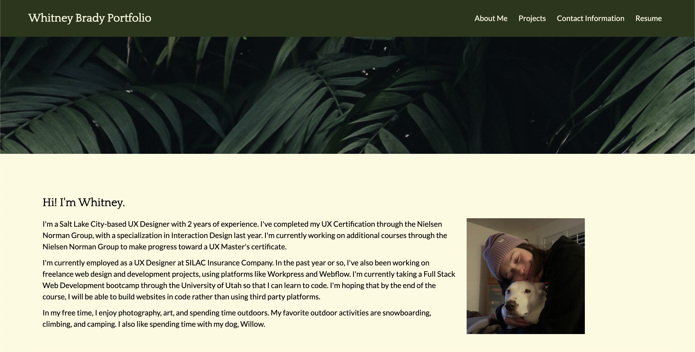
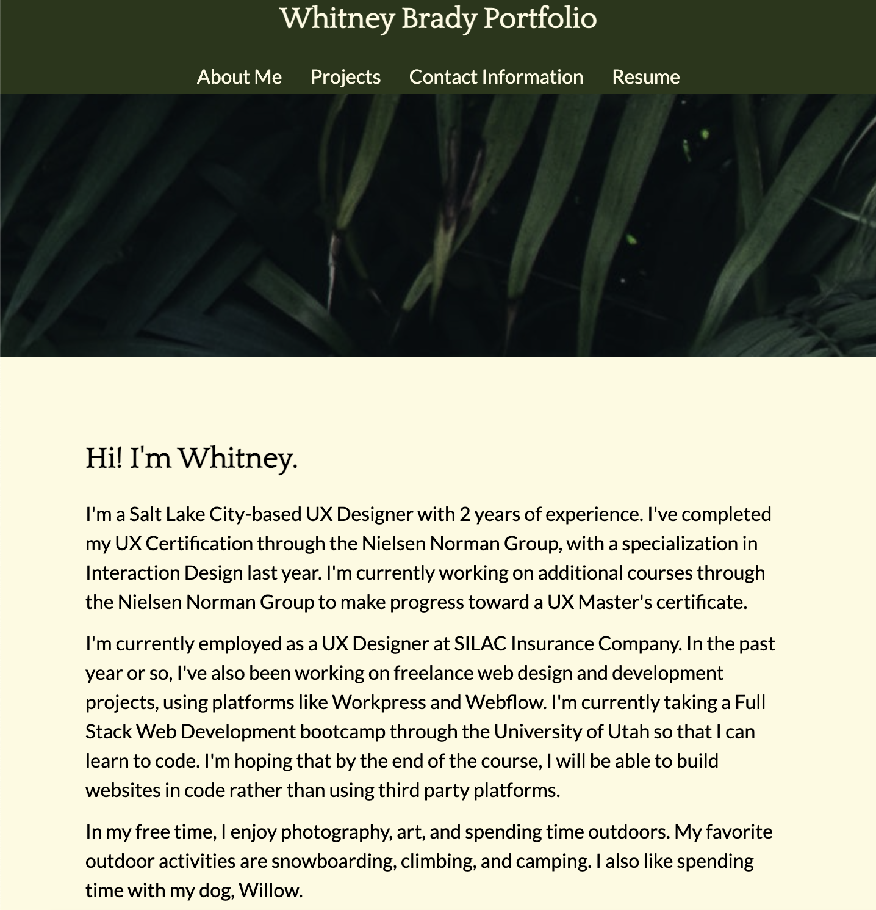
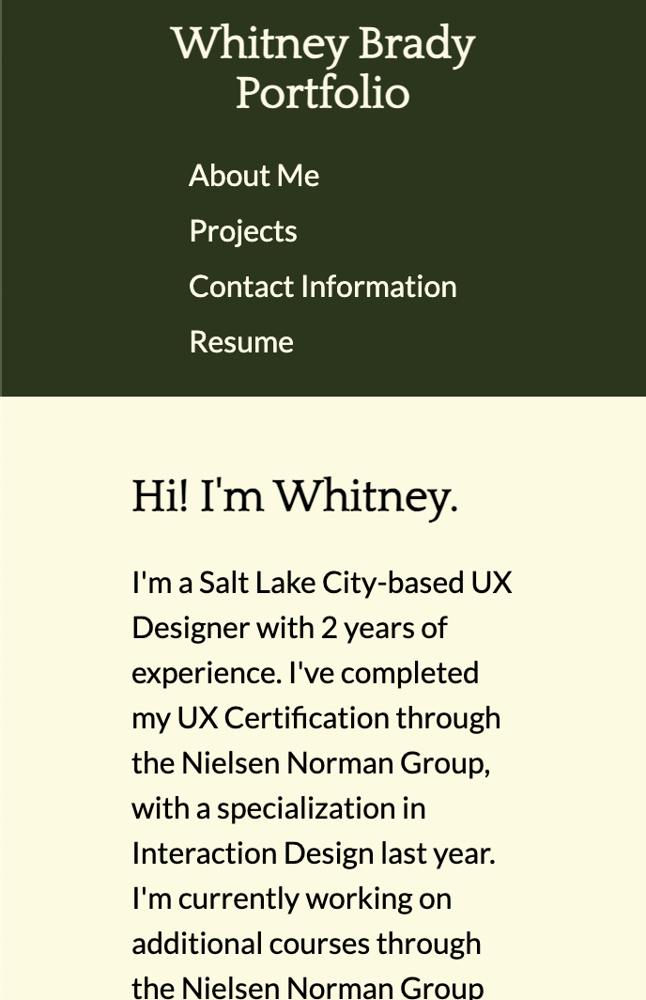

# week2-challenge: Professional Portfolio

## Description

The purpose of this project was to create a professional portfolio for myself, to provide to prospective employers. The portfolio site was supposed to be styled, responsive, and use the Advanced CSS that I've been learning for the past week in my coding bootcamp. This was my first website that I've fully built from scratch. 

## Installation

View and clone the repository here:

https://github.com/whitbreezy/week2-challenge

## Usage

Desktop Site:

Tablet Site:

Mobile Site:

## Credits

Google Fonts: https://fonts.google.com/
MDN: https://developer.mozilla.org/en-US/
W3 Schools: https://www.w3schools.com/

## License

See Repo for Licensing Information.

